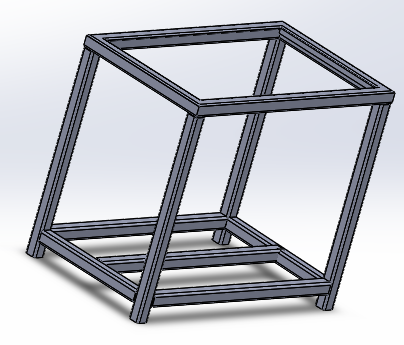
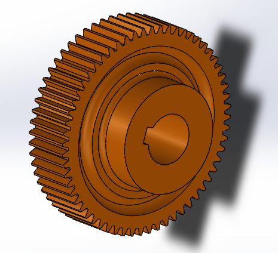
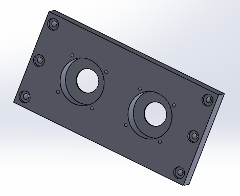
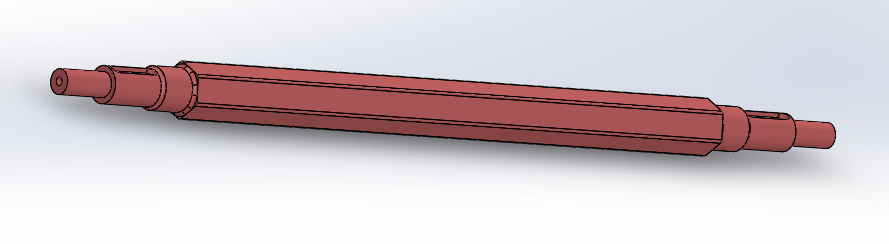
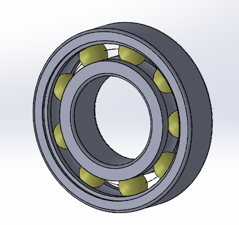
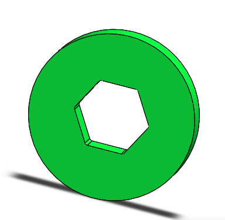

# Plastic-Shredder(Extruder).

##  The primary aim of a plastic shredder  is to reduce plastic pollution by recycling plastic waste into reusable materials.

### Working of Plastic Shredder

## Assembly

## Parts 

### 1.Structure Frame

### 2.Hopper

### 3.Moving Blade

### 4.Fix Blade

### 5.Gear

### 6.Bearing Mounting

### 7.Bearing Cover

### 8.Side Plate

### 9.Shaft

### 10.Bearing

### 11.Spacer

